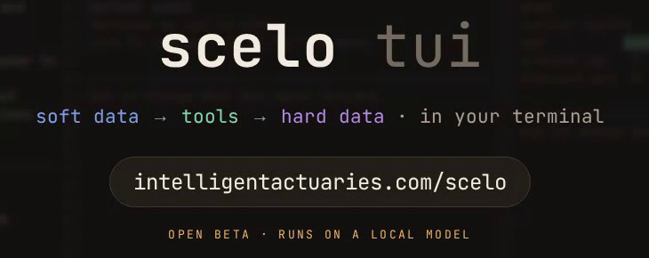

---
# The hero is the program's own 142-column screen. Both sidebars are hidden so
# that it has the width to be legible; the section tabs in the masthead still
# carry the navigation. See `.tui-screen` in stylesheets/extra.css.
hide:
  - navigation
  - toc
---

# Scelo TUI { .sr-only }

<figure class="tui-banner" markdown="0">
  
</figure>

**The three-pane Scelo workstation in a terminal.** Drop a file in and the agent
profiles it, cleans it to a fixed point, reads it, picks an analysis and runs
it. You steer what it decided from chat. The whole session exports to Python,
Jupyter, R, Excel and the Scelo IDE in one command.

!!! warning "Open beta"
    Scelo TUI is a working prototype under active development. It installs from
    source rather than from a release, the analysis menu is eight entries
    against the IDE's thirty, and there is no session persistence. See
    [Limits](reference/limits.md) for the honest list.

## What you are looking at

The whole product is one screen. Left is the data, middle is what the agent
decided, right is the result. Each pane has its own chat box at the bottom.

<!-- BEGIN tui-screen (generated by tools/render_screen.py) -->
<figure class="tui-screen" markdown="0">
  <div class="tui-screen__frame">
    <div class="tui-screen__panes" role="img" aria-label="The Scelo TUI screen: three panes side by side. Left, SOFT · data — book.csv at 900 rows by 7 columns after cleaning, and the agent&#x27;s reading of what the columns mean. Middle, TOOLS · models — the five pipeline stages, all complete, and the chosen analysis &#x27;Value by segment&#x27; with the runners-up beneath it. Right, HARD · output — sum_insured across line for five segments, as a table and as a bar chart, Motor highest at 87.0M. Each pane has its own chat box at the bottom.">
<pre class="tui-pane tui-pane--soft"><span class="f">╭─────────────────────────────────────────────╮</span>
<span class="f">│</span> <span class="title">SOFT · data</span> <span class="focus">◂ focus</span>                         <span class="f">│</span>
<span class="f">│</span>                                             <span class="f">│</span>
<span class="f">│</span> <span class="lbl">file(s)</span>                                     <span class="f">│</span>
<span class="f">│</span> <span class="f">└</span> book.csv                                  <span class="f">│</span>
<span class="f">│</span>   900 rows × 7 cols                         <span class="f">│</span>
<span class="f">│</span>                                             <span class="f">│</span>
<span class="f">│</span> <span class="lbl">summary</span>                                     <span class="f">│</span>
<span class="f">│</span> cleaned: 1 steps / 1 passes                 <span class="f">│</span>
<span class="f">│</span> dropped: notes                              <span class="f">│</span>
<span class="f">│</span>                                             <span class="f">│</span>
<span class="f">│</span> Rows represent one policy.                  <span class="f">│</span>
<span class="f">│</span> Key analytical columns:                     <span class="f">│</span>
<span class="f">│</span> - <span class="id">`inception`</span>: Policy start date.           <span class="f">│</span>
<span class="f">│</span> - <span class="id">`sum_insured`</span> and <span class="id">`premium`</span>: Financial    <span class="f">│</span>
<span class="f">│</span> details of policies.                        <span class="f">│</span>
<span class="f">│</span> Potential issues:                           <span class="f">│</span>
<span class="f">│</span> - <span class="id">`claims_paid`</span> has many missing values,    <span class="f">│</span>
<span class="f">│</span> which may limit analysis.                   <span class="f">│</span>
<span class="f">│</span>                                             <span class="f">│</span>
<span class="f">│</span> <span class="f">───────────────────────────────────────────</span> <span class="f">│</span>
<span class="f">│</span> ask to change what the agent decided<span class="dim">…</span>       <span class="f">│</span>
<span class="f">│</span>                                             <span class="f">│</span>
<span class="f">│</span>                                             <span class="f">│</span>
<span class="f">│</span>                                             <span class="f">│</span>
<span class="f">│</span>                                             <span class="f">│</span>
<span class="f">│</span>                                             <span class="f">│</span>
<span class="f">│</span> <span class="f">╭─────────────────────────────────────────╮</span> <span class="f">│</span>
<span class="f">│</span> <span class="f">│</span> <span class="prompt">›</span> <span class="cur">▌</span>                                     <span class="f">│</span> <span class="f">│</span>
<span class="f">│</span> <span class="f">╰─────────────────────────────────────────╯</span> <span class="f">│</span>
<span class="f">╰─────────────────────────────────────────────╯</span></pre>
<pre class="tui-pane tui-pane--tools"><span class="f">┌─────────────────────────────────────────────┐</span>
<span class="f">│</span> <span class="title">TOOLS · models</span>                              <span class="f">│</span>
<span class="f">│</span>                                             <span class="f">│</span>
<span class="f">│</span> <span class="lbl">pipeline</span>                                    <span class="f">│</span>
<span class="f">│</span> <span class="ok">✓</span> read file <span class="dim">·</span> 900 rows x 8 cols             <span class="f">│</span>
<span class="f">│</span> <span class="ok">✓</span> auto-clean <span class="dim">·</span> 1 step over 1 pass           <span class="f">│</span>
<span class="f">│</span> <span class="ok">✓</span> understand                                <span class="f">│</span>
<span class="f">│</span> <span class="ok">✓</span> choose analysis <span class="dim">·</span> Value by segment        <span class="f">│</span>
<span class="f">│</span> <span class="ok">✓</span> run <span class="dim">·</span> <span class="id">`sum_insured`</span> across <span class="id">`line`</span> (5      <span class="f">│</span>
<span class="f">│</span> segments)                                   <span class="f">│</span>
<span class="f">│</span>                                             <span class="f">│</span>
<span class="f">│</span> <span class="lbl">analyses</span>                                    <span class="f">│</span>
<span class="f">│</span> <span class="f">╔═════════════════════════╗</span>                 <span class="f">│</span>
<span class="f">│</span> <span class="f">║</span> <span class="bar">▓</span> book.csv              <span class="f">║</span>                 <span class="f">│</span>
<span class="f">│</span> <span class="f">║</span> 900 × 7 <span class="dim">·</span> 1 clean steps <span class="f">║</span>                 <span class="f">│</span>
<span class="f">│</span> <span class="f">╚═════════════════════════╝</span>                 <span class="f">│</span>
<span class="f">│</span>    <span class="f">│</span>                                        <span class="f">│</span>
<span class="f">│</span>    <span class="f">│</span>  <span class="f">┌────────────────────────────────┐</span>    <span class="f">│</span>
<span class="f">│</span>    <span class="f">├─▶│</span> <span class="on">●</span> Value by segment             <span class="f">│</span>    <span class="f">│</span>
<span class="f">│</span>    <span class="f">│</span>  <span class="f">└────────────────────────────────┘</span>    <span class="f">│</span>
<span class="f">│</span>    <span class="f">│</span>  <span class="f">┌────────────────────────────────┐</span>    <span class="f">│</span>
<span class="f">│</span>    <span class="f">├┄▶│</span> <span class="dim">·</span> Descriptive summary          <span class="f">│</span>    <span class="f">│</span>
<span class="f">│</span>    <span class="f">│</span>  <span class="f">└────────────────────────────────┘</span>    <span class="f">│</span>
<span class="f">│</span>    <span class="f">└┄▶</span> +5 more <span class="dim">·</span> <span class="cmd">/list</span>                      <span class="f">│</span>
<span class="f">│</span> To understand the distribution of premiums  <span class="f">│</span>
<span class="f">│</span> and claims paid by policy line and region.  <span class="f">│</span>
<span class="f">│</span> <span class="cmd">/run</span> to change <span class="dim">·</span> <span class="cmd">/list</span> for the menu         <span class="f">│</span>
<span class="f">│</span> <span class="f">╭─────────────────────────────────────────╮</span> <span class="f">│</span>
<span class="f">│</span> <span class="f">│</span> <span class="prompt">›</span> <span class="dim">…</span>                                     <span class="f">│</span> <span class="f">│</span>
<span class="f">│</span> <span class="f">╰─────────────────────────────────────────╯</span> <span class="f">│</span>
<span class="f">└─────────────────────────────────────────────┘</span></pre>
<pre class="tui-pane tui-pane--hard"><span class="f">┌──────────────────────────────────────────────┐</span>
<span class="f">│</span> <span class="title">HARD · output</span>                                <span class="f">│</span>
<span class="f">│</span>                                              <span class="f">│</span>
<span class="f">│</span> <span class="lbl">table</span>                                        <span class="f">│</span>
<span class="f">│</span> <span class="id">`sum_insured`</span> across <span class="id">`line`</span> (5 segments)     <span class="f">│</span>
<span class="f">│</span>                                              <span class="f">│</span>
<span class="f">│</span> segment     n   mean    total  share         <span class="f">│</span>
<span class="f">│</span> Motor       185 470,270 87.00M 21.7%         <span class="f">│</span>
<span class="f">│</span> Marine      184 455,146 83.75M 20.9%         <span class="f">│</span>
<span class="f">│</span> Liability   190 434,773 82.61M 20.6%         <span class="f">│</span>
<span class="f">│</span> Property    178 419,112 74.60M 18.6%         <span class="f">│</span>
<span class="f">│</span> Engineering 163 443,220 72.24M 18.1%         <span class="f">│</span>
<span class="f">│</span>                                              <span class="f">│</span>
<span class="f">│</span> <span class="lbl">plot</span>                                         <span class="f">│</span>
<span class="f">│</span> sum_insured total by line <span class="dim">·</span> <span class="cmd">/charts</span>          <span class="f">│</span>
<span class="f">│</span> Motor       <span class="bar">███████████████████████</span> 87.0M    <span class="f">│</span>
<span class="f">│</span> Marine      <span class="bar">██████████████████████</span> 83.7M     <span class="f">│</span>
<span class="f">│</span> Liability   <span class="bar">██████████████████████</span> 82.6M     <span class="f">│</span>
<span class="f">│</span> Property    <span class="bar">████████████████████</span> 74.6M       <span class="f">│</span>
<span class="f">│</span> Engineering <span class="bar">███████████████████</span> 72.2M        <span class="f">│</span>
<span class="f">│</span>                                              <span class="f">│</span>
<span class="f">│</span> <span class="lbl">flow</span>                                         <span class="f">│</span>
<span class="f">│</span> <span class="f">┌────────────────────┐</span>                       <span class="f">│</span>
<span class="f">│</span> <span class="f">│</span> <span class="on">●</span> Value by segment <span class="f">│─┐</span>                     <span class="f">│</span>
<span class="f">│</span> <span class="f">└────────────────────┘</span> <span class="f">│</span>                     <span class="f">│</span>
<span class="f">│</span>   <span class="f">┌────────────────────┘</span>                     <span class="f">│</span>
<span class="f">│</span>   <span class="f">▼</span>                                          <span class="f">│</span>
<span class="f">│</span> <span class="f">╭──────────────────────────────────────────╮</span> <span class="f">│</span>
<span class="f">│</span> <span class="f">│</span> <span class="prompt">›</span> <span class="dim">…</span>                                      <span class="f">│</span> <span class="f">│</span>
<span class="f">│</span> <span class="f">╰──────────────────────────────────────────╯</span> <span class="f">│</span>
<span class="f">└──────────────────────────────────────────────┘</span></pre>
    </div>
    <p class="tui-screen__keys">tab pane · drag to select+copy · ⏎ send (or paste a path) · ↑↓ history · /copy values · /help commands · ctrl-e export · ctrl-o model · ctrl-c quit</p>
  </div>
  <figcaption>
    Colour is the one thing here that is ours. The terminal draws this in
    ANSI; the panes are tinted to the site palette so that this screen and
    the demo on the marketing site agree about what each stage looks like.
  </figcaption>
</figure>
<!-- END tui-screen -->

Every screen on this site is a real capture of the running program, not a
mock-up.

## The idea

**Chat does not start work. Dropping a file does.** The agent ingests, cleans,
reads, picks and runs without being asked, and fills the panes as each stage
lands. The bots exist to *change what it decided*, which is why every pane
states what was done and why it was done.

That inverts the usual chat tool, where nothing happens until you compose a
good enough prompt. Here the useful default has already run by the time you
have finished reading the file name.

## Sixty seconds

```bash
scelo policies.csv
```

Pick a model, press ++enter++, and the panes fill. Then:

| you type | what happens |
|---|---|
| `/list` | the analyses that apply to this data, numbered |
| `/run 5` | switch to that one, the HARD pane re-renders |
| `/charts` | every plot this data makes, full screen |
| `/export` | six files: cleaned CSV, pandas, Jupyter, R, Excel, `.sce` |
| `/live` | mirror the session into RStudio and Jupyter as it runs |

Nothing above needs a model. [Slash commands](reference/commands.md) are
actions rather than conversation, and they keep working when the model is
unreachable.

## Where to go next

<div class="grid cards" markdown>

-   :material-download: **[Install](getting-started/install.md)**

    Two repos side by side, `bun install`, `bun link`. No build step.

-   :material-play: **[First run](getting-started/first-run.md)**

    The model picker, then dropping a file in.

-   :material-view-column: **[The three panes](guide/panes.md)**

    What each one shows and why it says what it says.

-   :material-export: **[Export](guide/export.md)**

    Six artifacts, and how they are verified against the pane.

</div>
